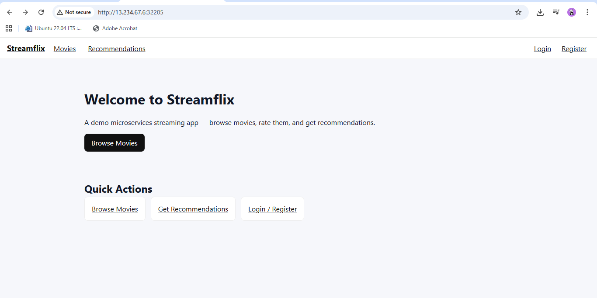

# 🎬 Streamflix — Modern Microservices OTT Platform

<p align="center">
  <!-- Frontend -->
  
  

  <!-- Backend -->

  
  
  
  

  <!-- Databases -->

  
  
  

  <!-- DevOps & Infra -->

  
  
  
  
  

  <!-- General -->

  
  

  <!-- Repo related badges -->

  
  
</p>

---

A **production-grade, cloud-native OTT platform** built using a **microservices architecture**, deployed on **Kubernetes (kubeadm)** with automated **Blue‑Green deployments**, **Ingress routing**, **Redis caching**, **MongoDB & PostgreSQL**, **NGINX API Gateway**, and **secure API integration using TMDB API key**.

---

## ⚡ Quickstart

### 1️⃣ Clone the repository

```bash
git clone https://github.com/gauravchile/streamflix.git
cd streamflix
```

### 2️⃣ Configure environment

```bash
cp .env.example .env
# Add your TMDB_API_KEY and DB credentials inside .env
```

### 3️⃣ Build & Run locally (Docker Compose)

```bash
docker compose up --build
```

### 4️⃣ Access frontend

```
http://localhost:3000
```

### 5️⃣ Deploy to Kubernetes

```bash
make k8s-apply
```

---

## 🚀 Overview

Streamflix simulates a real-world OTT ecosystem with a modern DevOps approach. It showcases:

* Kubernetes microservice deployments
* Blue-Green rollouts with zero downtime
* Secure API secrets via Kubernetes Secrets
* Multi-database orchestration (MongoDB + PostgreSQL + Redis)
* Automated CI/CD pipelines

---

## 🧱 Architecture Overview




---

## 🔧 Tech Stack

### **Frontend**

* React.js + Next.js
* TMDB API integration via `.env`
* Served through NGINX

### **Backend Microservices**

* **User Service** (Node.js + PostgreSQL)
* **Movie Service** (Node.js + MongoDB + TMDB API integration)
* **Rating Service** (Python Flask + MongoDB)
* **Recommendation Service** (Node.js + Redis)

### **Infrastructure & CI/CD**

* Docker + Kubernetes (kubeadm on AWS EC2)
* Blue/Green Deployments
* Jenkins or GitHub Actions pipelines
* Secrets and ConfigMaps for environment isolation

---

## 💾 Secure API Key Integration (TMDB)

All API keys are stored securely using **Kubernetes Secrets** and **.env files**.

**Example:** `movie-service` uses TMDB API for fetching trending movies.

```js
const apiKey = process.env.TMDB_API_KEY;
const response = await fetch(`https://api.themoviedb.org/3/movie/popular?api_key=${apiKey}`);
```

Stored in:

```yaml
apiVersion: v1
kind: Secret
metadata:
  name: streamflix-secrets
  namespace: streamflix
type: Opaque
stringData:
  TMDB_API_KEY: "your_tmdb_api_key_here"
```

---

## 🐳 Dockerization

Each microservice includes:

* Multi-stage Dockerfile
* Health checks
* Environment variable configuration
* Lightweight production images

---

## ☸️ Kubernetes Deployment (Blue-Green)

* Blue (current production)
* Green (staging/test)
* Switch versions by changing service selector

```yaml
apiVersion: v1
kind: Service
metadata:
  name: movie-service
  namespace: streamflix
spec:
  selector:
    app: movie-service
    version: blue  # switch to green during rollout
  ports:
    - port: 5000
      targetPort: 5000
```

---

## 🌐 Ingress Setup

Unified external access through NGINX Ingress:

```yaml
apiVersion: networking.k8s.io/v1
kind: Ingress
metadata:
  name: streamflix-ingress
  namespace: streamflix
spec:
  ingressClassName: nginx
  rules:
  - http:
      paths:
      - path: /
        pathType: Prefix
        backend:
          service:
            name: api-gateway
            port:
              number: 80
```

Access via:

```
http://<EC2_PUBLIC_IP>:<NodePort>
```

---

## 🗃 Databases

| Service        | Database   | Description               |
| -------------- | ---------- | ------------------------- |
| User           | PostgreSQL | Authentication, sessions  |
| Movie          | MongoDB    | Movie catalog + TMDB data |
| Rating         | MongoDB    | User ratings              |
| Recommendation | Redis      | Cached recommendations    |

---

## 🧪 Seed Runner

Seeds initial demo data into MongoDB, Redis, and Postgres.

---

## 🔌 API Gateway (NGINX)

Central routing hub for all microservices.

```nginx
location /api/movie/ {
  proxy_pass http://movie-service.streamflix.svc.cluster.local:5000/;
}
```

---

## 📊 Key Features

* Full microservices setup
* Docker + Kubernetes orchestration
* Blue-Green deployments
* Secure TMDB API integration
* Redis caching for recommendations
* NGINX Ingress routing
* Configurable CI/CD pipelines
* Horizontal scaling ready

---

## 🛠 How to Deploy

### Local

```bash
docker compose up --build
```

### Kubernetes

```bash
make k8s-apply
```

### Delete

```bash
make k8s-delete
```

---

## 🧹 Troubleshooting

**Ingress not reachable:**

```bash
kubectl -n ingress-nginx get svc ingress-nginx-controller
```

**Check secrets:**

```bash
kubectl -n streamflix get secrets streamflix-secrets -o yaml
```

**Pod logs:**

```bash
kubectl logs -n streamflix deploy/movie-service-blue
```

---

## 🔒 Security

* Secrets managed via `Kubernetes Secrets`
* Environment variables loaded at runtime
* No hardcoded credentials in code or YAMLs

---

## 🌍 Git Hygiene

**Never commit:** `.env`, `k8s/streamflix-secrets-config.yaml`, credentials, or database volumes.

Provide example templates instead:

```bash
cp .env.example .env
```

---

## 📜 License

MIT License — free for personal or educational use.

---
