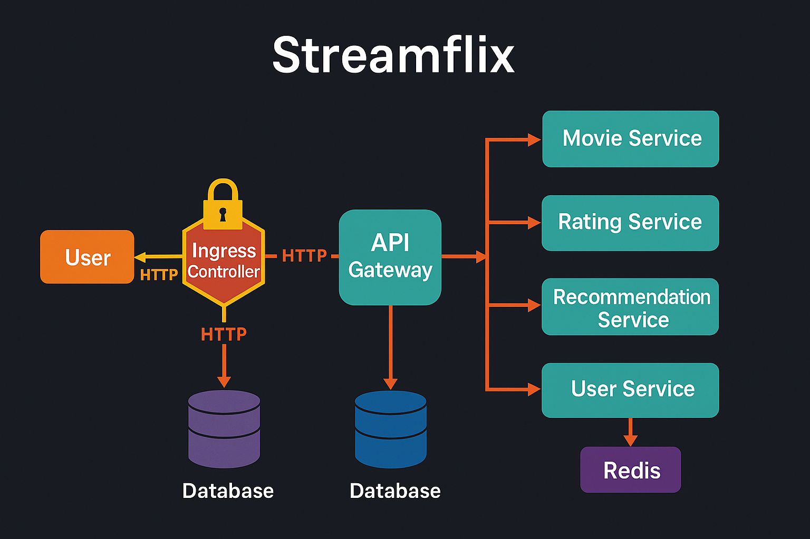

# 🎬 Streamflix — Modern Microservices OTT Platform on Kubernetes

<p align="center">
  <!-- Frontend -->
  
  

  <!-- Backend -->
  
  
  
  

  <!-- Databases -->
  
  
  

  <!-- DevOps & Infra -->
  
  
  
  

  <!-- CI/CD / GitHub -->
  

  <!-- General -->
  
  

  <!-- Repo related badges -->
  
  
</p>


A **production-grade, cloud-native OTT platform** built using a **microservices architecture**, deployed on **Kubernetes (kubeadm)** with automated **Blue‑Green deployments**, **Ingress routing**, **Redis caching**, **MongoDB & PostgreSQL**, and **NGINX API Gateway**.

---

## 🚀 1. Overview

Streamflix is a full microservices ecosystem simulating a real-world OTT platform. It showcases DevOps skills such as:

* Kubernetes deployments at scale
* Blue-Green deployments
* ConfigMaps, Secrets, StatefulSets
* API Gateway routing
* Horizontal scalability
* Local-path storage provisioning
* Multi-service communication inside a mesh-like structure

---

## 🧱 2. Production Architecture Diagram

![Streamflix Webpage] (Screenshots/Streamflix.PNG)


---

## 🔧 3. Tech Stack

### **Frontend**

* React.js
* Served through NGINX

### **Backend Microservices**

* **User Service** (Node.js + PostgreSQL)
* **Movie Service** (Node.js + MongoDB)
* **Rating Service** (Python Flask + MongoDB)
* **Recommendation Service** (Node.js + Redis)

### **Infrastructure**

* Kubernetes (kubeadm on AWS EC2)
* ConfigMaps, Secrets, Deployments, StatefulSets
* Local Path Storage Provisioner
* NGINX Ingress Controller
* Redis cache

---

## 🐳 4. Dockerization (All Services)

Each service includes:

* Multi-stage Dockerfile
* Environment-based configuration
* Health checks
* Optimized small images

Example (Movie Service):

```dockerfile
FROM node:18-alpine
WORKDIR /app
COPY package*.json ./
RUN npm install --production
COPY . .
CMD ["npm", "start"]
```

---

## ☸️ 5. Kubernetes Setup

This project was deployed on:

* **Ubuntu 24.04 EC2 instance**
* **Kubeadm cluster (single-node)**
* **Containerd runtime**
* **Calico CNI**

### Key Objects Used

| Component     | Type                     |
| ------------- | ------------------------ |
| API Gateway   | Deployment + Service     |
| Microservices | Deployments + Services   |
| MongoDB       | StatefulSet              |
| PostgreSQL    | StatefulSet              |
| Redis         | Deployment + Service     |
| Ingress       | NGINX Ingress Controller |
| Seed Runner   | Job                      |

---

## 🔄 6. Blue‑Green Deployment Strategy

Every microservice has two versions:

* `*-blue`
* `*-green`

### Flow

1. Deploy green version
2. Test traffic internally
3. Switch Ingress/API gateway to new version
4. Scale down blue version

This ensures **zero downtime releases**.

---

## 🌐 7. Ingress Setup (Without Hostname)

```yaml
apiVersion: networking.k8s.io/v1
kind: Ingress
metadata:
  name: streamflix-ingress
  namespace: streamflix
spec:
  ingressClassName: nginx
  rules:
  - http:
      paths:
      - path: /
        pathType: Prefix
        backend:
          service:
            name: api-gateway
            port:
              number: 80
```

You can access everything using:

```
http://<EC2_PUBLIC_IP>:32205
```

(32205 = NodePort of ingress nginx controller)

---

## 📦 8. Database Design

### MongoDB — Movies, Ratings

* Collections: `movies`, `ratings`
* Shallow normalized structure for query performance

### PostgreSQL — User Service

* Tables: `users`, `sessions`
* Relational model for authentication

### Redis — Recommendations Cache

* Optimizes API latency
* Stores trending movies, cached results

---

## 🧪 9. Seed Runner

Loads initial data into:

* MongoDB (Movies)
* MongoDB (Ratings)
* Postgres (Users)

Runs as a Kubernetes Job:

```yaml
kind: Job
metadata:
  name: streamflix-seed-job
```

---

## 🔍 10. API Gateway

Acts as a router for all microservices.

### Example Route

```nginx
location /api/movie/ {
  proxy_pass http://movie-service.<namespace>.svc.cluster.local:5000/;
}
```

---

## 📊 11. Features

✔ Fully Dockerized Microservices
✔ Production‑grade Kubernetes YAMLs
✔ Blue‑Green Deployments
✔ Zero-downtime rollouts
✔ Redis caching for recommendations
✔ API Gateway with NGINX
✔ Ingress for unified external access
✔ Stateful database pods
✔ Local persistent storage
✔ Seed automation job
✔ Environment variable‑based configs
✔ Isolated namespaces
✔ Supports horizontal scaling

---

## 🛠 12. How to Deploy (Local or Cloud)

### Step 1 — Clone Repo

```bash
git clone https://github.com/gauravchile/streamflix.git
cd streamflix
```

### Step 2 — Build  and Push All Images

```bash
make docker
```

### Step 3 — Push Images

```bash
make push
```

### Step 4 — Deploy and Cleanup Kubernetes

```bash
make k8s-apply
```

```bash
make k8s-delete
```

---

## 🧹 13. Troubleshooting Common Issues

### Disk Pressure on Single Node

* Clean containerd
* Restart kubelet
* Add more storage

### Ingress Not Accessible

```bash
kubectl apply -f https://raw.githubusercontent.com/kubernetes/ingress-nginx/main/deploy/static/provider/cloud/deploy.yaml
```

```bash
kubectl -n ingress-nginx get pods

kubectl -n ingress-nginx get svc ingress-nginx-controller

kubectl get svc -n ingress-nginx
```

Use NodePort if no LoadBalancer available.

---

## 📜 14. License

MIT License — free to use.

---

## ⭐ 15. Support / Contributions

Feel free to submit issues or PRs.

If this helped you, star ⭐ the repo!
